# 🎨 Vinllage - Frontend

> 사용자 인터페이스와 화면 렌더링을 담당하는 영역

---

## 📌 개요

- React / Next.js 기반의 웹 애플리케이션
- 반응형 UI, 라우팅, API 연동 담당

---

## 🖥️ 주요 기능

### 회원

- 회원가입 / 로그인

- **이메일 인증**: 비밀번호 찾기, 회원 탈퇴, 계정 복구

- 정보 수정

- 탈퇴

### 분리수거

- 쓰레기 감지 및 카테고리 분류: 실시간 카메라 감지로 직관적인 분리수거 안내

- 회원 - 감지 결과 저장 & 마이페이지 통계 제공

- 비회원 - 최초 이용 후 30일 내 3회 체험 가능

- 쓰레기 카테고리 결과 페이지

  1. 감지된 쓰레기를 카테고리별로 분류
  2. 감지한 당시의 쓰레기 이미지만을 가져오기 위해 gid 활용
  3. 해당 카테고리에 맞는 분리배출 가이드 제공
  4. 매일 12시마다 비회원이 감지한 쓰레기 이미지 데이터 삭제

### 게시판

- 게시판 & 댓글: 게시판을 통한 정보 공유 & 소통 (회원/비회원 가능)

### 행사

- `/admin/crawler`: 크롤러 설정과 스케줄러를 제어하는 관리자 페이지

  #### 주요 기능


  - **설정 관리**: 대상 URL, 키워드, CSS 선택자를 폼으로 입력하고 저장합니다.
  - **실시간 테스트**: 입력된 설정으로 `/crawler/test`에 요청하여 결과를 다이얼로그로 확인합니다.
  - **스케줄러 토글**: `/crawler/scheduler` 엔드포인트에 활성/비활성 이벤트를 전송하여 크롤링 작업을 제어합니다.

  ##### 이벤트 흐름

  1.  **입력 이벤트** (`onChange`)
      - 폼 필드를 수정하면 내부 상태가 갱신되고 즉시 검증 오류가 해제됩니다.
  2.  **저장 이벤트** (`save`)
      - 검증 후 `/crawler/configs`로 POST 요청을 전송하고, 성공 시 알림 이벤트가 발생합니다.
  3.  **테스트 이벤트** (`onTest`)
      - "테스트" 버튼 클릭 시 비동기 요청을 보내고 응답을 다이얼로그에 표시합니다.
  4.  **스케줄러 이벤트** (`toggleScheduler`)
      - 버튼 클릭으로 스케줄러의 활성화 상태를 전환합니다.

- `/event`: 환경 행사를 열람하는 공개 페이지
  #### 주요 기능
  - **행사 목록**: 서버에서 환경 행사 데이터를 페치하여 리스트로 출력합니다.
  - **검색 & 페이지네이션**: 키워드와 날짜로 필터링하며 페이지 이동이 가능합니다.
  - **상세 보기**: `/event/[hash]` 경로에서 행사 세부 내용을 제공합니다.

### 마이페이지

- 사용자 정보 관리, 분리수거 이미지 통계 차트
- 개인 정보 수정 및 탈퇴
- 분리 배출 이미지 기록

---

## 🛠️ 기술 스택

- **Framework**: Next.js (React, TypeScript)
- **Style**: Tailwind CSS / Styled-components
- **Database**: MySQL
- **Infra**: Docker, AWS(EC2)

---

## ⚙️ 개발 모드 실행 (로컬)

```bash
yarn install
yarn dev
```

---

## 👨‍👩‍👧‍👦 팀원 역할

| 이름   | 역할 | 담당                                               |
| ------ | ---- | -------------------------------------------------- |
| 오다은 | 팀장 | 분리수거 감지 페이지(웹캠), 백엔드/프론트엔드 총괄 |
| 이소민 | 팀장 | 마이페이지, 디자인 총괄, BE 배포                   |
| 김송미 | 팀원 | 행사 페이지 (웹크롤링 - 관리자, 회원)              |
| 송근호 | 팀원 | 로그인/회원가입                                    |
| 안슬기 | 팀원 | 게시판 (관리자, 회원)                              |
| 오경석 | 팀원 | 분리수거 결과 페이지, FE 배포                      |

---

## 📅 개발 일정

- 1주차: 기획 & 설계
- 2~4주차: 기능 개발
- 5주차: 테스트, 배포 및 발표

---
## 오경석 

### ⚙️ 기능 설명  

- 결과 페이지  
  - 웹캠으로 감지된 쓰레기를 카테고리별로 분류하여 표시 
  - 선택된 카테고리에 맞는 분리배출 이미지 제공 
  - 감지된 이미지와 함께 카테고리 버튼 제공 → 카테고리 선택 시 분리배출 가이드 표시 
  - "다시 찍기" 버튼을 통해 재촬영 가능  
  - API에서 매일 12시마다 비회원이 감지한 이미지 삭제  


### 📝 코드 리뷰

- ResultContainer  
  - `gid`를 쿼리 파라미터로 받아 API(`/recycle/result`) 호출 → 감지 결과 데이터 로드  
  - 서버 응답에서 카테고리(`data`)와 이미지(`imageUrl`)를 파싱하여 평탄화(flatten)  
    - 이미지 데이터가 JSON 형태로 전달되며, 경우에 따라 2개의 URL이 포함될 수 있음 
  - `FlatImage[]` 형태로 변환 → 이미지 + 카테고리 정보 관리  
  - 페이지네이션 적용 (한 페이지당 4개 이미지 표시)   
  - 쓰레기 감지 후 첫 번째 카테고리에 맞는 분리배출 이미지 기본 조회  
  - "다시 찍기" 버튼 클릭 시 `/recycle` 경로로 이동  

- ResultList  
  - 감지된 이미지와 카테고리를 표시  
  - 카테고리 버튼 클릭 시 `onSelect` 콜백을 통해 상위로 이벤트 전달  
  - `기타` 카테고리는 선택 불가(disabled 처리)  

- RecycleGuide   
  - 선택된 카테고리(`selectedCategory`)에 맞는 분리배출 가이드를 렌더링  
  - 카테고리별 대표 분리배출 이미지(플라스틱, 비닐, 캔, 유리, 종이)를 매핑하여 출력  
  - 가이드 상단에 카테고리 이름(`category2`)을 배지 형태로 표시    
  - `기타` 카테고리는 분리배출 이미지 표시하지 않음  


## 📷 스크린샷

### 메인 페이지

- 공지 모달창


- 메인 페이지


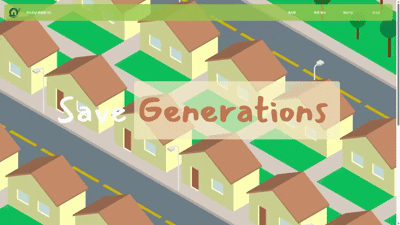

### 회원

- 회원가입

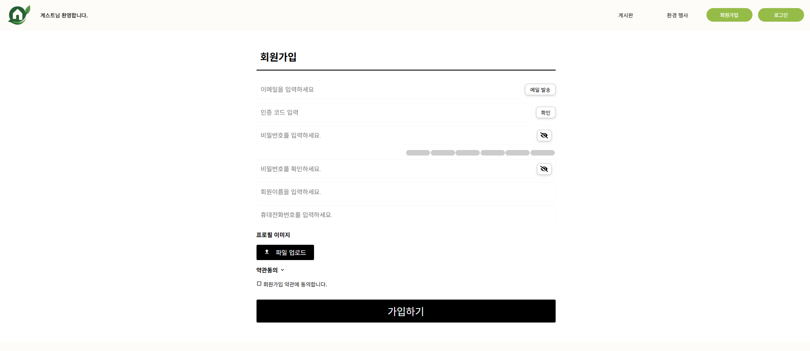

- 로그인

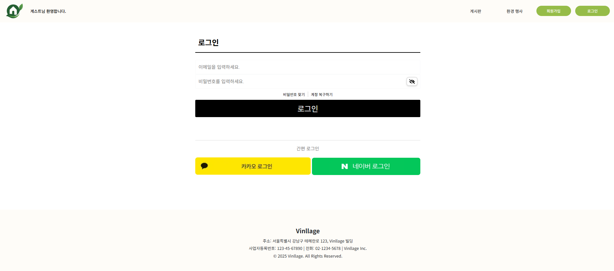

### 분리수거

- 분리수거 감지 페이지

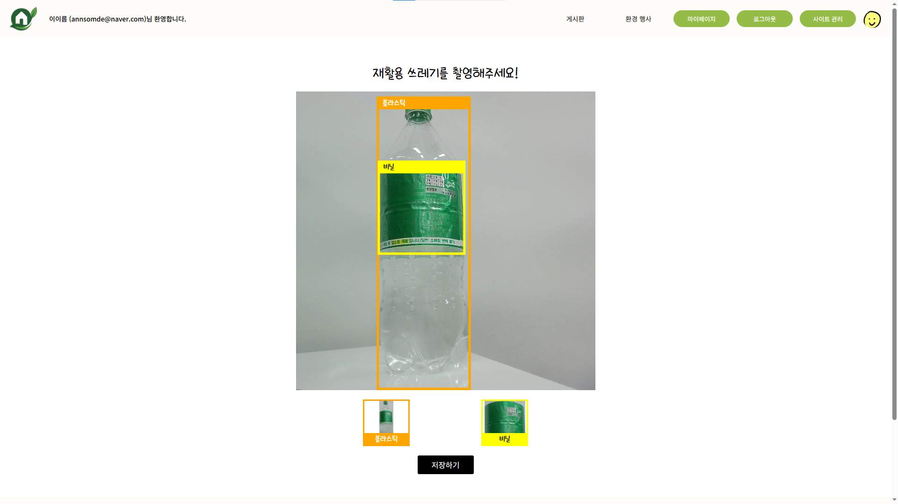

- 분리수거 결과 페이지

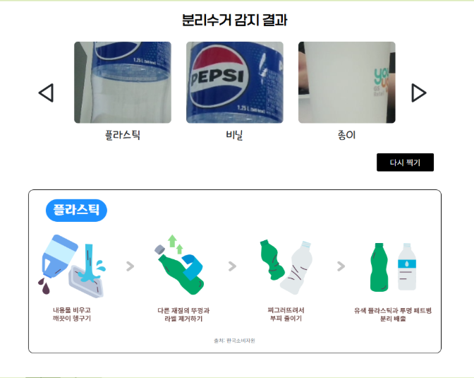

### 마이페이지

- 홈

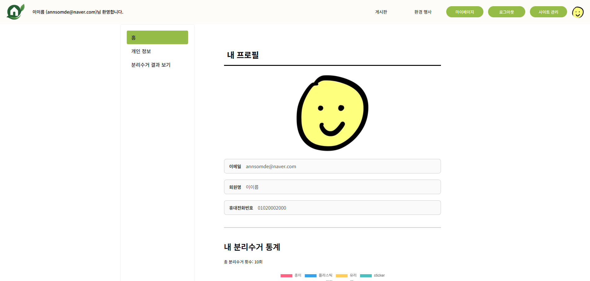

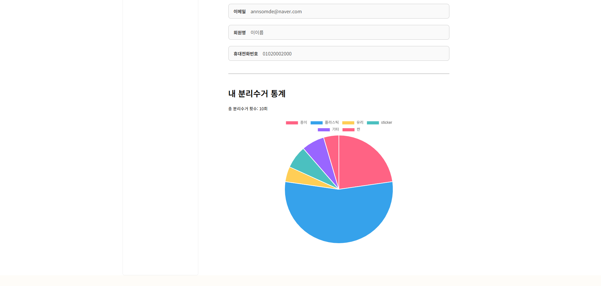

- 정보 수정


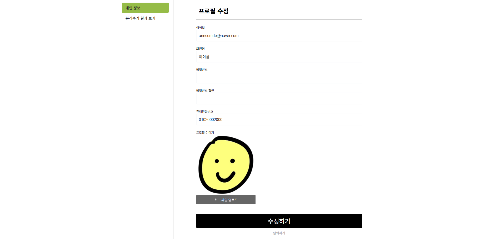

- 분리수거 내역


### 환경보호 페이지
- 관리자 - 행사 관리 페이지

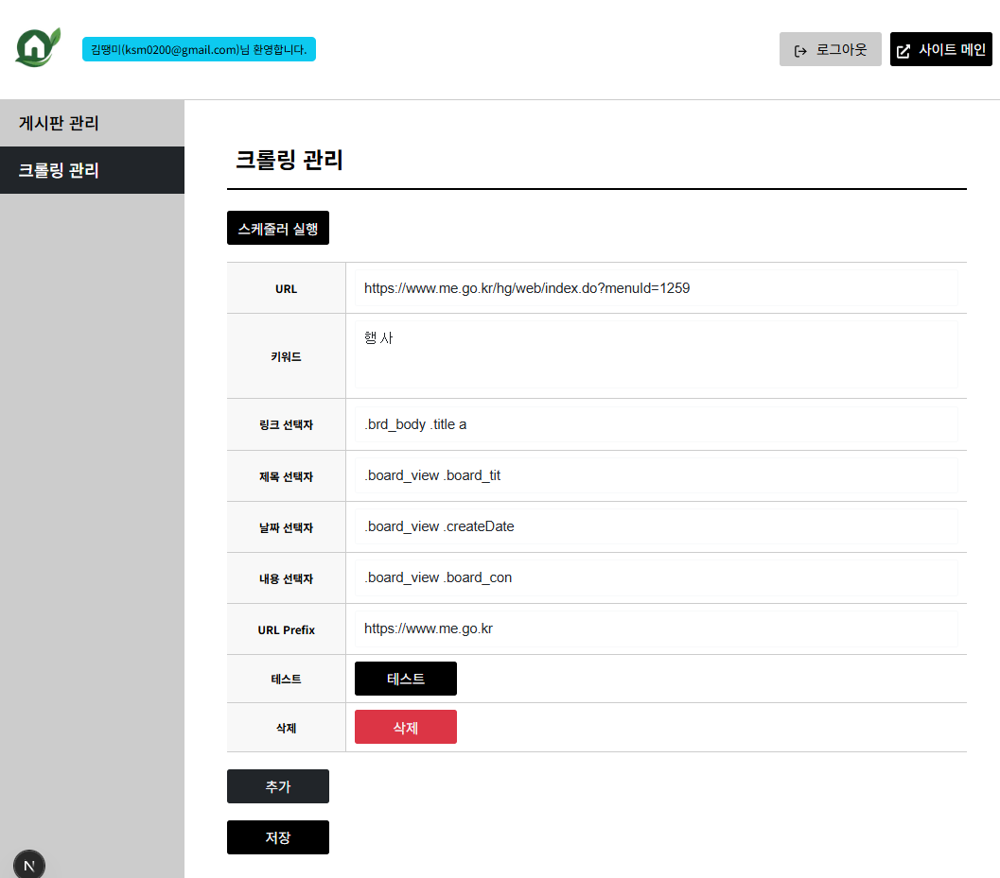
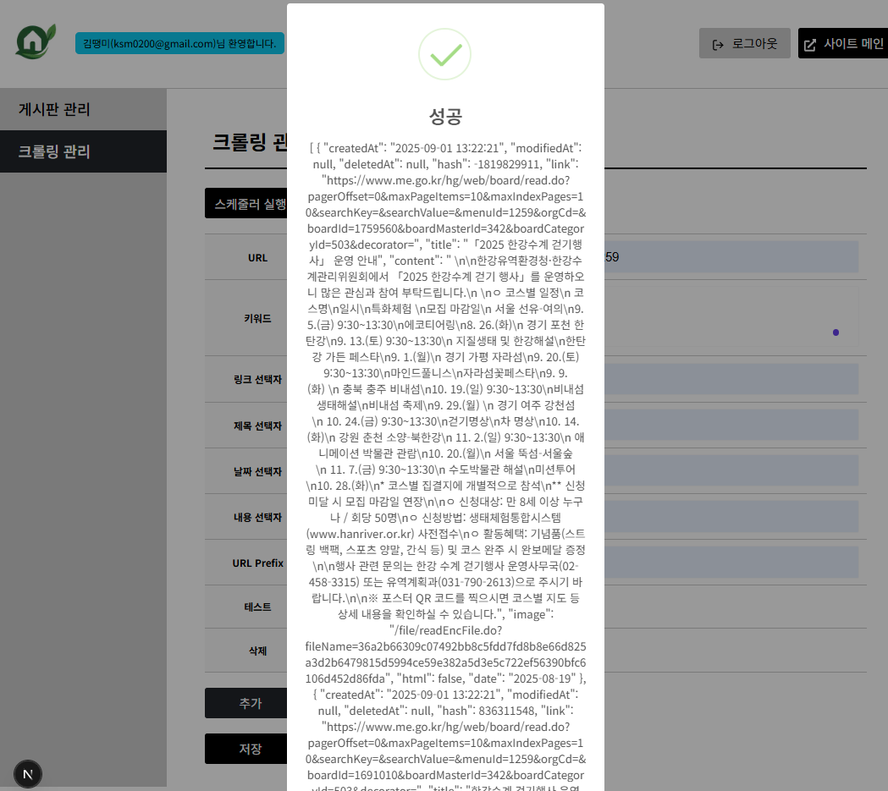

- 회원(비회원) - 행사 정보 페이지
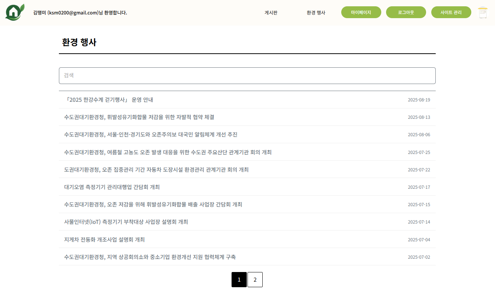
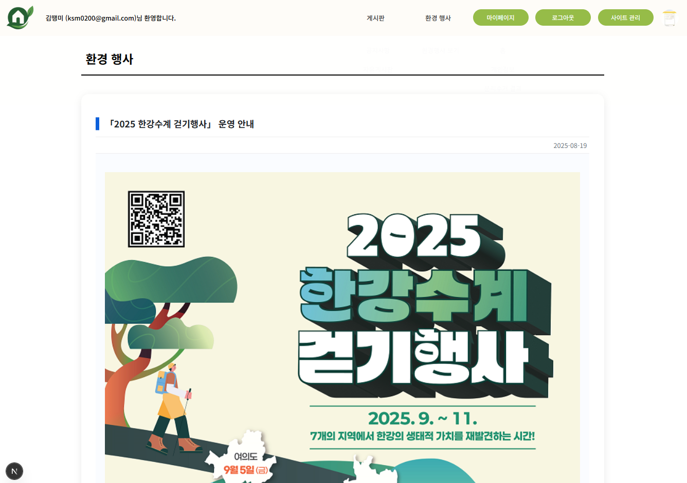
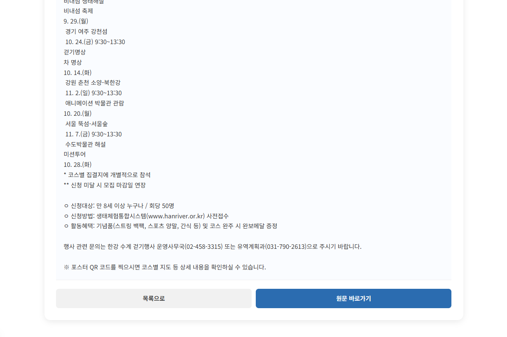
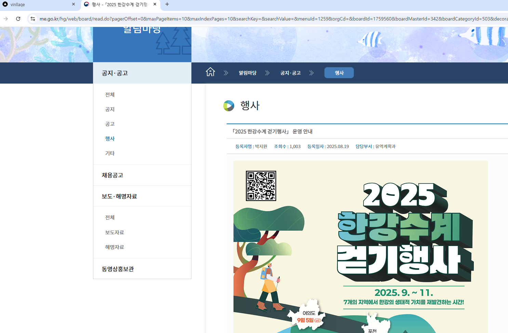

### 게시판

- 회원(비회원) - 공지사항, 자유게시판

- 관리자 - 게시판 관리 페이지


