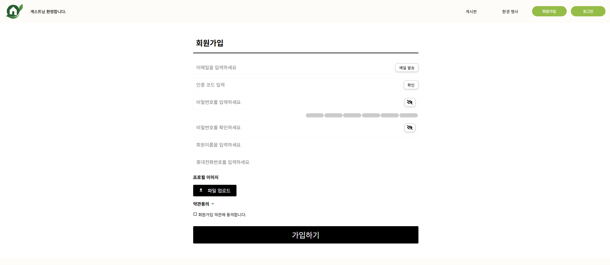
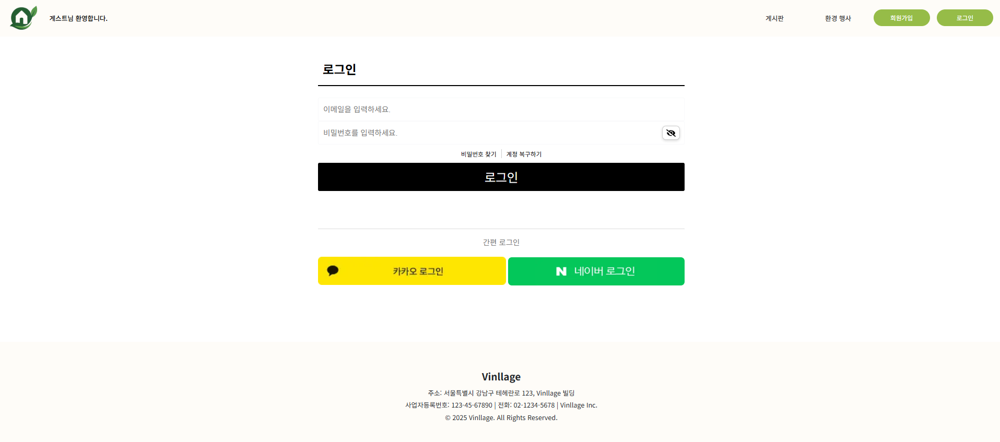
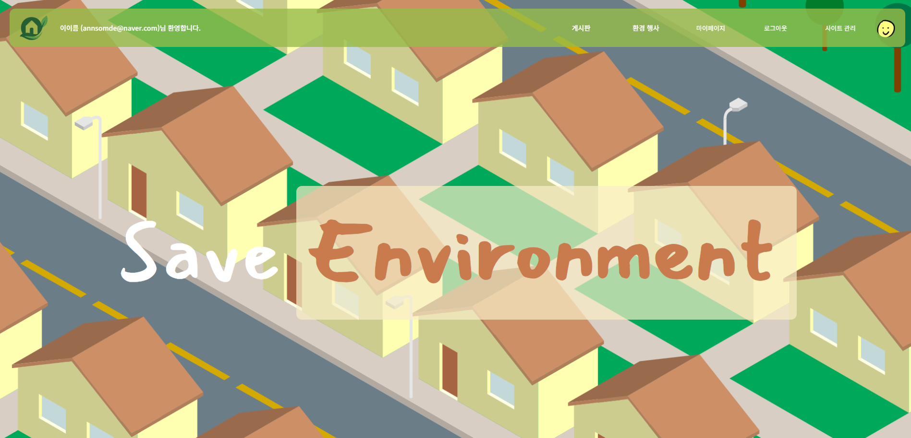
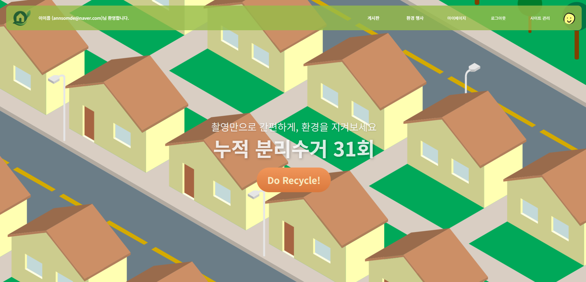
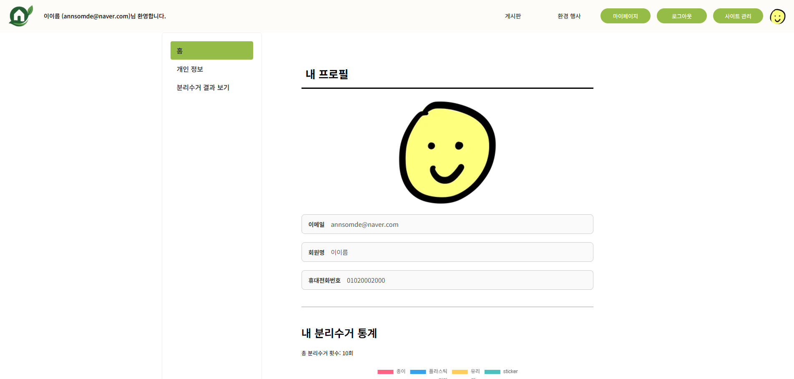
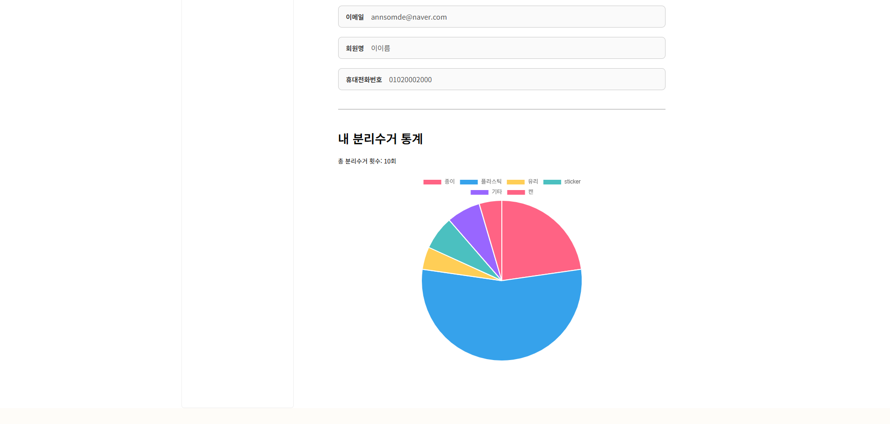
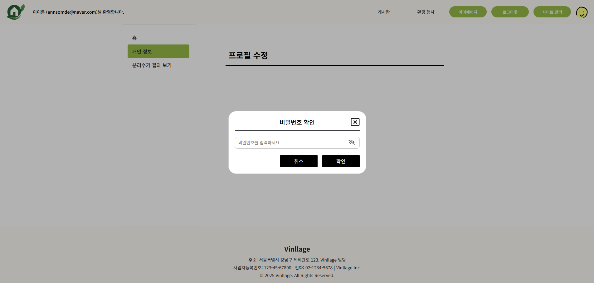
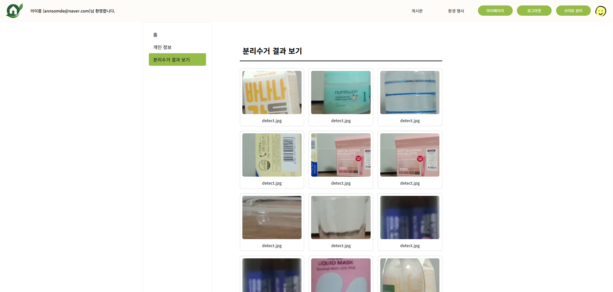

# 🎨 Frontend

> 사용자 인터페이스와 화면 렌더링을 담당하는 영역

---

## 📌 개요

- React / Next.js 기반의 웹 애플리케이션
- 반응형 UI, 라우팅, API 연동 담당

---

## 🖥️ 주요 기능

### 회원

- 회원가입 / 로그인

  - 설명

- 정보 수정
- 탈퇴

### 분리수거

- 쓰레기 감지 및 카테고리 분류

### 게시판

- 게시판 & 댓글

### 행사

- 행사 정보 웹크롤링

### 마이페이지

- 사용자 정보 관리, 분리수거 이미지 통계 차트
- 개인 정보 수정 및 탈퇴
- 분리 배출 이미지 기록

---

## 🛠️ 기술 스택

- **Framework**: Next.js (React, TypeScript)
- **Style**: Tailwind CSS / Styled-components
- **Database**: MySQL
- **Infra**: Docker, AWS(EC2)

---

## ⚙️ 실행 방법

```bash
cd frontend
npm install
npm run dev
```

---

## 👨‍👩‍👧‍👦 팀원 역할

| 이름   | 역할 | 담당                                               |
| ------ | ---- | -------------------------------------------------- |
| 오다은 | 팀장 | 분리수거 감지 페이지(웹캠), 백엔드/프론트엔드 총괄 |
| 이소민 | 팀장 | 마이페이지, 디자인 총괄, BE 배포                   |
| 김송미 | 팀원 | 행사 페이지 (웹크롤링)                             |
| 송근호 | 팀원 | 로그인/회원가입                                    |
| 안슬기 | 팀원 | 게시판                                             |
| 오경석 | 팀원 | 분리수거 결과 페이지, FE 배포                      |

---

## 📅 개발 일정

- 1주차: 기획 & 설계
- 2~4주차: 기능 개발
- 5주차: 테스트, 배포 및 발표

---

## 📷 스크린샷









